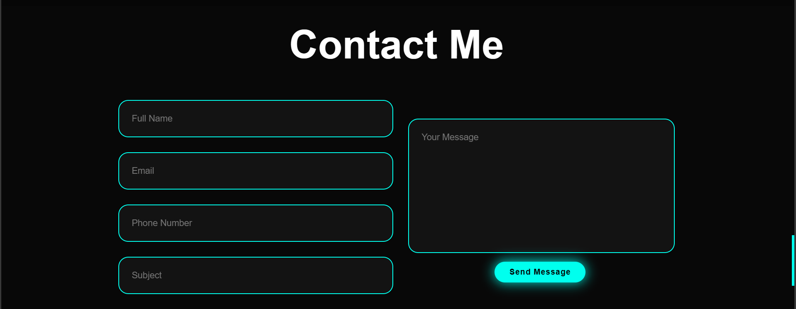

#  "PORTFOLIO WEBSITE DEMO")
# Portfolio Website Practice Demo
## REQUIREMENTS
### *_I. Name of project_*
    Alana Larissa Portfolio Pratice Demo - LIKE A CV
### *_II. Purpose_*
This project is a portfolio that I made for practice. Sample taken from youtube on How to Web Dev channel.
- Header:
  
  + Logo is the name of the portfolio owner.
  + Navbar menu: menu of content items on the web to navigate to each part of the web.
- Items Content:
  + Home:
    
    * Content-left:
      + Briefly introduce yourself: Present each occupation one by one.
      + Social icons: link to social websites of self.
      + Group of button: hire and contact(navigate to contact div in page)
    * Content-right: Profile image
      
  + Education: containe timeline and education's self in each year until now(jobs and schools)
    
  + Services: show skills in tech
    
  + Testimonials: from the other people that work with
    
  + Contact: fill blank of textbox for contacting to hire
    
  + Footer:
    
### *_III. Link References_*
  https://youtu.be/UqHILyzcULE?si=DFuydOn2V8cP1Cwh
  
